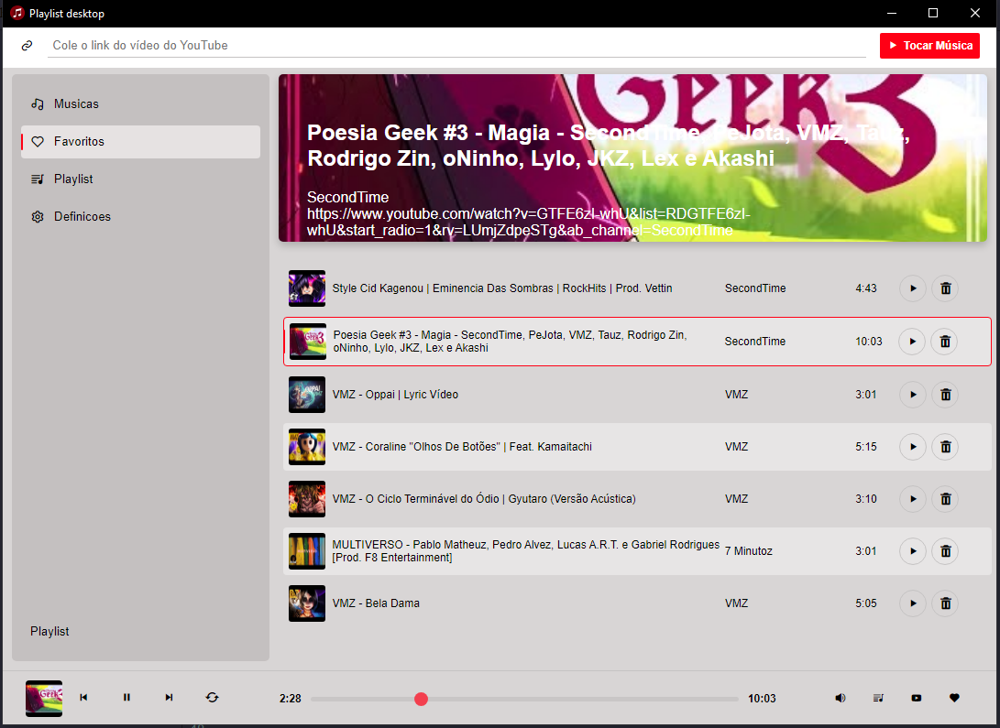
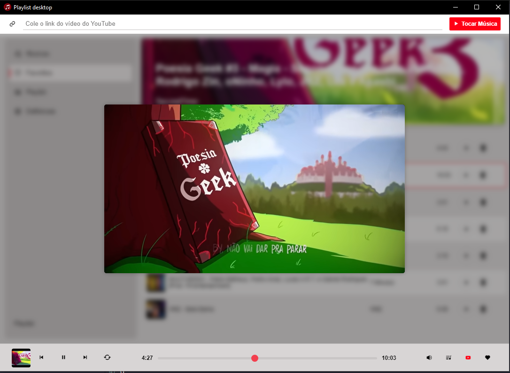

# 🎵 Playlist Desktop


Playlist Desktop é uma aplicação Electron que utiliza React para a interface do usuário e Tailwind CSS para estilização. Esta aplicação permite gerenciar playlists de forma eficiente e intuitiva.


## Prototipo

<div align="center">
    
    
</div>

## 📋 Funcionalidades

- Interface de usuário moderna com React
- Estilização com Tailwind CSS
- Suporte a múltiplas janelas modais
- Configuração de Webpack para compilação de arquivos
- Scripts de construção para desenvolvimento e produção

## 🚀 Como começar

1. Clone o repositório:
   ```sh
   git clone https://github.com/mr-body/playlist.git
   ```

2. Instale as dependências:
   ```sh
   npm install
   ```
3. Inicie a aplicação:
   ```sh
   npm run react
   npm start
   ```
## Inicie a aplicação:
## 📂 Estrutura do Projeto
* src/: Contém os arquivos fonte da aplicação.
* public/: Contém os arquivos HTML públicos.
* dist/: Diretório de saída para os arquivos compilados.
* main.js: Arquivo principal da aplicação Electron.
* webpack.config.js: Configuração do Webpack.

## 🤝 Contribuição
Sinta-se à vontade para abrir issues e pull requests para contribuir com o projeto.

## 📄 Licença
Este projeto está licenciado sob a Licença MIT - veja o arquivo LICENSE para mais detalhes.

